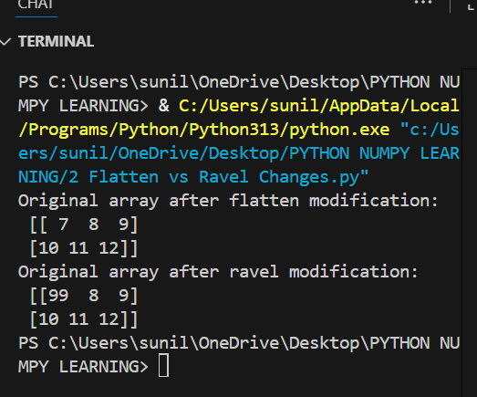

# 🧵 Python NumPy – Array Attributes  

This repository is a structured guide to mastering **NumPy Array Attributes**, an essential foundation for understanding how arrays work in Python.  
It focuses on exploring the **properties and metadata** of NumPy arrays, which are critical for data analysis, memory optimization, and efficient computation.  

It features practical tasks that cover array shape, dimensions, size, datatype, memory consumption, and more. Perfect for beginners and learners who want hands-on practice with NumPy fundamentals.  

---

## 📂 Task Progression:

## 📂 Task Progression: Beginner ➡️ Advanced  

| 🧪 Task File | 📝 Statement | 📄 Source Code | 🖥️ Output |
|--------------|--------------|----------------|------------|
| [Attributes of numpy.py](numpy%20attributes/Attributes%20of%20numpy.py) |  |  |  |

---

## ✅ What I Practiced  

- 📌 Understanding **array shape, rows & columns**  
- 🔄 Checking the **number of dimensions (ndim)**  
- ✖️ Counting **total elements with size**  
- 📊 Exploring **data types (dtype) of arrays**  
- 💾 Measuring **memory usage per element (itemsize)**  
- 🗂️ Calculating **total memory consumption (nbytes)**  

---

## 👨‍💻 About Me  

📊 **Sunil Kumar Reddy Punnati**  
🎓 MCA Graduate | 💼 Data Analyst Intern  
📍 Tirupati, India  
💡 Passionate about Python, NumPy, and Data Analysis  
🚀 Actively preparing for full-time roles in **Data Analytics** and **Software Development**  

I believe in **learning by doing**, and this project reflects my commitment to mastering NumPy fundamentals with clean, structured coding.  

---

## 🔗 Connect With Me  

🌐 [LinkedIn](#)  
💻 [GitHub](#)  

---

## 🙌 Connect & Support  

If you’re a **recruiter, mentor, or fellow learner** — let’s connect and grow together!  
⭐ Star this repo if you found it helpful or inspiring.  

---

## ℹ️ Summary  

A curated **NumPy Array Attributes** task covering shape, dimensions, size, data type, memory usage, and efficiency.  
Each task includes **source code and output screenshots** to help learners build confidence in NumPy fundamentals for data analysis.  
